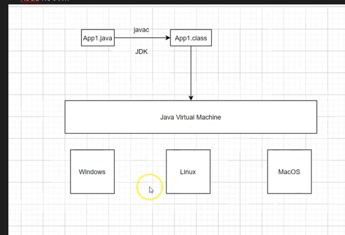

# Projeto no qual eu documento todo meu aprendizado de Java pelos videos do YTB do Dev Dojo !

# Como Java funciona
- Roda no JVM 

# Aprendizados
- Linguagem baseada em pacotes, nada mais é que pastas do projeto.
- Arquivos devem comecar com o package