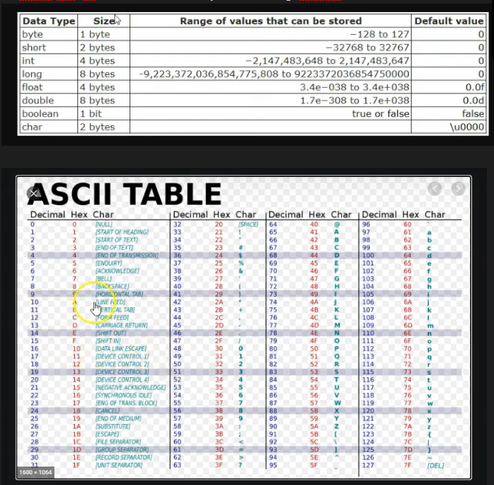

# Projeto no qual eu documento todo meu aprendizado de Java pelos videos do YTB do Dev Dojo !

# Como Java funciona
- Roda no JVM 


# Aprendizados
- Linguagem baseada em pacotes, nada mais é que pastas do projeto.
- Arquivos devem comecar com o package

# Tipos primitivos
- No java vc tem que declarar qual tipo primitivo
- Sendo eles: int, double, float, char, byte, short , long, boolean



### Casting
- Vai "comunicar" com o computador que a variável é aquela mesma
- Força colocar uma variável dentro da outra !
- Colocar um float pra double, etc
```
float salarioFloat = 2500.0f;
```
### string é uma classe no java